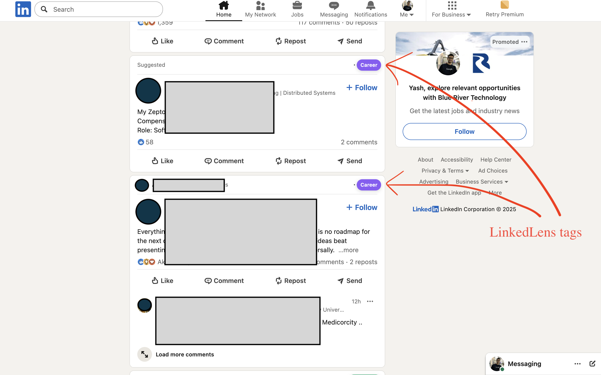

# LinkedLens

## What is it?

LinkedLens is a simple LinkedIn browsing companion designed to enhance your LinkedIn experience by helping you categorize and tag posts as you browse.

You define the categories and describe them.

Once the extension is running, it will automatically categorize LinkedIn posts and place a colored tag in the top right corner of each post, showing which category it belongs to.



Note: LinkedLens is a Chrome extension.

## Motivation

LinkedIn can be useful, but I find some categories of posts really annoying and spammy, and thought of making my LinkedIn experience better. So I built this extension and decided to share it.

## Features

LinkedLens helps you categorize and tag LinkedIn posts as you browse. You can use three possible LLM backends:

- **Ollama** - Your local, 100% free, self-hosted solution
- **OpenAI API** - Using OpenAI's language models
- **Gemini API** - Using Google's Gemini language models

More features coming soon!

## How to Use

Since this extension is not published on the Chrome Web Store, you'll need to load it as an unpacked extension:

1. Clone this repository:
   ```bash
   git clone https://github.com/yash91sharma/LinkedLens.git
   ```

2. Open Chrome and navigate to `chrome://extensions/`

3. Enable "Developer mode" by toggling the switch in the top right corner

4. Click "Load unpacked" and select the LinkedLens folder

5. The extension will now be installed and ready to use

6. Click on the LinkedLens icon in your chrome toolbar, then:
   - Define your categories (what kinds of posts you want to identify)
   - Select an LLM backend (Ollama, OpenAI API, or Gemini API)
   - Configure your API keys if using OpenAI or Gemini

7. If using Ollama as your LLM backend, prepare it to accept requests from the extension:
   ```bash
   OLLAMA_ORIGINS=chrome-extension://<your-extension-id> ollama serve
   ```

## Contributions Welcome

Use it, report bugs, request features, and even better, contribute to this repo! Your feedback and contributions help make LinkedLens better for everyone.
